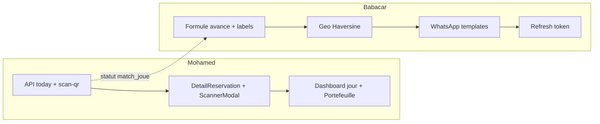

# Répartition du travail — Mohamed & Babacar

**Référence :** Cahier des charges technique v2.1 (Sénégal Foot Résa / TerrainSN)  
**Objectif :** Finir les fonctionnalités restantes de façon **équitable**, sans se marcher sur les fichiers.  
**Branches :** `MOHAMED_COULIBALY` · `babacar_sene` · fusion via PR vers `main`

---

## Principe anti-conflits

| Règle | Détail |
|--------|--------|
| **Propriété de zone** | Chaque dév est **seul** à modifier ses dossiers listés ci-dessous |
| **Fichiers partagés** | Toucher uniquement sa section, ou se synchroniser avant (Slack / vocal) |
| **Schéma DB** | Toute migration `database.js` / `seed.js` = **PR courte dédiée**, validée à deux |
| **API commune** | Mohamed = routes `/gerant/*` + scan · Babacar = `/terrains`, auth, WhatsApp |
| **Pas de rewrite massif** | Renommer `acompte` → `avance` côté UI sans casser les colonnes DB legacy d’un coup |

---

## État actuel (déjà en place — ne pas refaire)

- Auth joueur / backoffice, OTP WhatsApp de base  
- Réservation + PayTech (simulation)  
- PWA (manifest, SW, install prompt, Web Push)  
- Espaces propriétaire / super admin (terrains, revenus, abonnements, santé)  
- Scanner gérant **générique** (`/backoffice/gerant/scanner`) + anti-fraude partielle (`qr_code_scanne_at`)  
- API portefeuille gérant `GET /gerant/portefeuille` (backend OK, **pas d’UI**)  
- SQLite WAL activé  

---

## Vue d’ensemble du partage

| Domaine CDC v2.1 | Responsable | Charge estimée |
|------------------|-------------|----------------|
| Flux check-in gérant + QR contextualisé (§7, §7.1, §7.2, §10) | **Mohamed** | ~50 % |
| Portefeuille gérant UI + sécurisation scan JWT terrain (§9, §11) | **Mohamed** | |
| Géolocalisation / Haversine / filtres quartier (§6) | **Babacar** | ~50 % |
| Sémantique & calcul **avance** (§4) côté joueur + labels | **Babacar** | |
| Templates WhatsApp officiels (§8) | **Babacar** | |
| Session JWT + `refresh_token` cookie HTTPOnly (§2) | **Babacar** | |
| Alignement statuts `match_joue` / endpoints §10 | **Mohamed** (API) + review Babacar | |
| Migration sémantique DB `acompte` → `avance` (alias) | **Commun** (PR dédiée, Mohamed propose, Babacar review) | |

---

## MOHAMED — Lot A « Gérant & Anti-fraude QR »

### Mission

Mettre le parcours gérant **conforme v2.1** : plus de scan « sauvage » hors contexte ; check-in chronologique du jour ; portefeuille visible.

### Livrables CDC

1. **`GET /api/gerant/reservations/today`**  
   Réservations du jour du terrain du gérant, tri `heure_debut ASC`.

2. **Dashboard gérant — onglet « Réservations du jour »**  
   Liste chronologique → clic → fiche détail.

3. **Page `DetailReservation`**  
   Route suggérée : `/backoffice/gerant/reservations/:id`  
   Bouton **« Scanner le QR Code »** uniquement si statut `confirme`.

4. **`ScannerModal`** (refactor depuis `Scanner.tsx`)  
   Caméra ouverte **dans le contexte** de la réservation ; compare l’ID scanné à la réservation ouverte.

5. **Endpoint scan v2.1**  
   - Garder ou aliaser : `POST /api/reservations/:id/scan-qr`  
   - Si `qr_code_scanne_at` non null → **403** + message : *« Ce code QR a déjà été scanné le [Date/Heure] »*  
   - Sinon → statut **`match_joue`** + horodatage  
   - Vérifier que le JWT gérant ne scanne que **son** terrain (§11)

6. **Page `Portefeuille.jsx`**  
   Consommer `GET /gerant/portefeuille` : solde, commissions, historique reversements.

7. **Retirer / déprécier** l’entrée nav « Scanner » libre une fois le flux fiche → modal en prod (ou la laisser en fallback derrière feature flag le temps de la bascule).

### Fichiers autorisés (Mohamed)

```
frontend/src/espaces/backoffice/pages/gerant/**          ← propriétaire
frontend/src/espaces/backoffice/layout/GerantChrome.tsx
frontend/src/espaces/backoffice/components/BlockSlotModal.tsx   (si besoin check-in)
frontend/src/espaces/profil/ProfilGerant.tsx                   (si lien portefeuille)

backend/index.js          → UNIQUEMENT blocs /gerant/* et /scanner /scan-qr
backend/routes/roles.js   → portefeuille / creneaux gérant
backend/services/auditService.js   (logs qr_scanne)
```

### Critères d’acceptation

- [ ] Impossible de scanner un QR sans ouvrir la fiche de la réservation concernée  
- [ ] Double scan → erreur bloquante avec date/heure du premier scan  
- [ ] Liste du jour triée par heure  
- [ ] Portefeuille affiche solde + historique  
- [ ] Aucune modification des pages joueur (`espaces/joueur/**`)

---

## BABACAR — Lot B « Joueur, Avance, Geo & Notifications »

### Mission

Aligner l’expérience joueur et les notifications sur le CDC v2.1 (avance, distance, messages officiels, session).

### Livrables CDC

1. **Géolocalisation (§6)**  
   - Demander `navigator.geolocation` sur Accueil / Recherche  
   - Backend : tri Haversine (ou calcul côté API) si lat/lng fournis  
   - Si refus → tri défaut + **filtre par quartier**

2. **Calcul avance (§4)** — front joueur  
   ```
   montant_avance = ARRONDI(prix_choisi × pourcentage_avance / 100)
   montant_restant = prix_choisi - montant_avance
   ```  
   Remplacer les `Math.min(..., montant_acompte)` et libellés **« acompte »** → **« avance »** dans l’UI joueur (Reservation, FicheTerrain, Confirmation, Success…).

3. **Templates WhatsApp (§8.1 → §8.5)** dans `notificationService.js`  
   - OTP inscription  
   - Confirmation réservation + avance + QR + lien Maps + mention usage unique  
   - Lien paiement (résa téléphone, validité 2 h)  
   - Remboursement créneau pris  
   - Reversement solde gérant  

4. **Session persistante (§2)**  
   - JWT 30 j en `localStorage` (déjà partiel)  
   - `refresh_token` en cookie **HTTPOnly** + renouvellement silencieux  
   - Endpoint refresh + vérif au démarrage app (`use-auth` / `AuthContext`)

5. **PayTech (§4)** — vérifier côté appel paiement que le montant envoyé = `montant_avance` exact (pas un montant fixe legacy). Toucher `paytechService.js` + flux joueur uniquement.

6. **Skeletons** manquants sur les écrans joueur encore vides au chargement (hors pages déjà couvertes).

### Fichiers autorisés (Babacar)

```
frontend/src/espaces/joueur/**
frontend/src/auth/**                    (Login, refresh, OTP)
frontend/src/hooks/use-auth.tsx
frontend/src/components/skeletons/**
frontend/src/components/pwa/**          (si polish session / offline lié joueur)
frontend/src/lib/api.ts                 → sections auth + terrains + joueur uniquement
frontend/src/lib/offlineStore.ts        (si lié sync joueur)

backend/notificationService.js
backend/otpService.js
backend/whatsappClient.js               (si templates / pièces jointes QR)
backend/paytechService.js
backend/pushService.js                  (rappels match complémentaires WhatsApp)
backend/index.js                        → UNIQUEMENT /auth/*, /terrains*, refresh, Haversine list
backend/middleware/auth.js
```

### Critères d’acceptation

- [ ] Terrains triés par distance si geo accordée, sinon filtre quartier  
- [ ] Aucun libellé « acompte » visible côté joueur (sauf colonnes DB legacy non exposées)  
- [ ] Formule avance = % du prix choisi  
- [ ] 5 modèles WhatsApp alignés sur le texte du CDC  
- [ ] Refresh token cookie HTTPOnly opérationnel  
- [ ] Aucune modification des pages `espaces/backoffice/pages/gerant/**`

---

## Zone commune (coordination obligatoire)

| Sujet | Qui propose | Qui review |
|-------|-------------|------------|
| Colonnes / alias `montant_avance` vs `acompte` dans `database.js` | Mohamed | Babacar |
| Statut unifié `joue` → `match_joue` (migration douce) | Mohamed | Babacar |
| Conflits sur `backend/index.js` | Découper en routes dédiées si trop de friction | Les deux |
| Conflits sur `frontend/src/lib/api.ts` | Chacun sa section (`gerantApi` / `terrainsApi` / `authApi`) | Les deux |
| `AppRouter.tsx` | Mohamed ajoute routes gérant ; Babacar n’y touche que pour auth/joueur | PR séparées |

---

## Ordre de livraison recommandé



1. **Semaine 1** — Mohamed : API today + durcissement scan · Babacar : avance + labels joueur  
2. **Semaine 2** — Mohamed : DetailReservation + ScannerModal · Babacar : geo + WhatsApp  
3. **Semaine 3** — Mohamed : Portefeuille + nettoyage nav · Babacar : refresh token · **recette croisée**

---

## Convention Git

```bash
# Mohamed
git checkout MOHAMED_COULIBALY
# commits préfixés : feat(gerant): … | fix(scan): …

# Babacar
git checkout babacar_sene
# commits préfixés : feat(joueur): … | feat(whatsapp): … | feat(auth): …
```

- **1 PR = 1 lot cohérent** (pas un mega-merge)  
- Rebase / merge `main` **avant** chaque PR  
- Ne jamais push `--force` sur `main`  
- Si besoin de la même ligne dans un fichier partagé → message avant de commit

---

## Recette croisée (fin de sprint)

| Test | Qui exécute |
|------|-------------|
| Parcours joueur : geo → fiche → paiement avance → WhatsApp | Mohamed teste le travail de Babacar |
| Parcours gérant : liste du jour → détail → scan unique → portefeuille | Babacar teste le travail de Mohamed |
| Double scan QR = rejet 403 | Les deux |
| Libellés « avance » partout UI joueur | Mohamed vérifie |

---

## Contacts zones

| Développeur | Focus | Ne pas toucher |
|-------------|-------|----------------|
| **Mohamed** | Backoffice gérant, QR, portefeuille, scan API | `espaces/joueur/**`, WhatsApp templates, geo |
| **Babacar** | Joueur, avance, geo, WhatsApp, auth refresh | `espaces/backoffice/pages/gerant/**`, ScannerModal |

En cas de doute sur un fichier hors liste : **demander avant de commit**.
